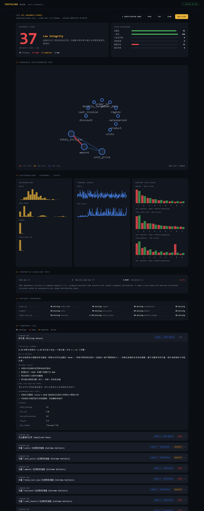

# TruthLens 真相镜

> **Can you trust your data?**

A **statistical forensics engine** for detecting suspicious patterns, anomalies,
inconsistencies and hidden structures in tabular data. Upload a CSV or Excel
file and TruthLens audits it across four forensic layers, produces an
**Integrity Score**, and explains — in plain language — *why* each pattern
deserves investigation.

**Evidence-first. It never cries fraud.** Every finding is phrased as a
statistical observation with plausible alternative explanations, limitations,
and concrete next steps. TruthLens is a forensic tool, not a judge.

中文定位：**数据取证与统计可信度分析平台**。它不是 Excel 清洗工具，而是一个面向数据的
「数字取证实验室」。

---

## Demo

```
Upload → Analyze → Investigate → Explain → Report
```

The repo ships with `datasets/examples/suspicious_sales.xlsx`, a demo dataset
with **planted anomalies**: duplicate row blocks, scattered exact duplicates,
extreme outliers, a mechanical column copy (r = 1.0000), an unnaturally stable
variance series, a spliced time-series level shift, Benford deviation, and
non-random missingness. One click on **RUN BUNDLED DEMO** and the engine
recovers ~12 classes of findings with a full integrity report.



## What it detects

| Layer | Module | Signals |
|---|---|---|
| 1 · Data Health | `quality.py` | missing values, exact duplicates, constant columns, mixed types, illegal negatives, label pollution |
| 2 · Statistical | `outliers.py` `correlation.py` `distribution.py` `temporal.py` | robust-z / IQR outliers, near-perfect correlations, extreme skew, time gaps, level shifts, abnormally constant variance |
| 3 · Pattern Forensics | `benford.py` `pattern.py` | Benford first-digit deviation (χ² + Nigrini MAD), last-digit bias, value pile-ups, group-statistics uniformity, repeated row blocks, column copies |
| Baseline | `synthetic.py` | i.i.d. bootstrap baseline — is the observed dependency structure stronger than the marginals alone can produce? |
| 4 · Fingerprint | `fingerprint.py` | distribution / correlation / missingness / digit / duplication signatures + weighted **Integrity Score** (0–100) over six dimensions |

Every finding carries: statistical summary, why it matters, possible causes,
**what it does not prove**, and recommended next steps.

## Highlights

- **Integrity Score** — a 0–100 trustworthiness score with a six-dimension
  breakdown (完整性 / 一致性 / 分布自然度 / 异常程度 / 重复风险 / 模式异常).
- **Investigator Mode** — the report as a digital forensic case file
  (`CASE #TL-…`) with evidence levels and per-finding drill-downs.
- **Variable Relationship Map** — an interactive correlation network showing
  which relations are abnormally strong.
- **Synthetic Data Test** — compares real dependency structure against an
  i.i.d. resampling baseline.
- **Explain Why** — every statistic is translated into human language with
  multiple plausible explanations and explicit limitations.
- **Report export** — standalone **HTML**, **PDF**, and machine-readable **JSON**.
- **SQLite** persistence of every scan.

## Tech stack

| Layer | Stack |
|---|---|
| Frontend | Next.js 14 · TypeScript · custom SVG charts · forensic-terminal UI |
| Backend | Python 3.11+ · FastAPI · uvicorn |
| Analysis | pandas · numpy · scipy · scikit-learn · statsmodels |
| Files | openpyxl · pyarrow |
| Storage | SQLite (default) |
| Deploy | docker-compose |

## Quick start

### 1. Backend (FastAPI)

```bash
cd backend
python -m venv .venv
# Windows
.venv\Scripts\activate
# macOS / Linux
source .venv/bin/activate

pip install -r requirements.txt
uvicorn api.main:app --reload --port 8000
```

Health check: <http://localhost:8000/api/health>

### 2. Frontend (Next.js)

```bash
cd frontend
npm install
npm run dev
```

Open <http://localhost:3000>. The frontend calls the backend at
`http://localhost:8000` (override with `NEXT_PUBLIC_API_URL`).

### 3. Docker (both at once)

```bash
docker-compose up --build
```

- Frontend: <http://localhost:3000>
- Backend API: <http://localhost:8000>
- API docs (Swagger): <http://localhost:8000/docs>

## One-click demo

```bash
# after backend is running
curl http://localhost:8000/api/demo
```

or click **RUN BUNDLED DEMO** on the homepage.

## Report export

```
GET /api/analyses/{scan_id}/report?format=html|pdf|json
```

## Tests

```bash
cd backend
pip install pytest httpx
python -m pytest ../tests -v
```

The suite covers every detection module plus the full API surface
(upload → scan → HTML/PDF/JSON export).

## Project structure

```
truthlens/
├── frontend/          # Next.js 14 + TypeScript UI
│   ├── app/           # pages, layout, global styles
│   ├── components/    # score hero, findings, network graph, charts
│   └── lib/           # API client
├── backend/
│   ├── api/           # FastAPI routes
│   ├── analysis/      # the forensic engine (9 modules)
│   ├── reports/       # HTML / PDF / JSON report generators
│   └── storage.py     # SQLite persistence
├── datasets/examples/ # suspicious_sales.xlsx demo dataset
├── scripts/           # demo dataset generator
├── tests/             # pytest suite
└── docs/
```

## Methodology & limitations

TruthLens is a **screening tool**. Statistical tests detect patterns; they do
not read intentions.

- Benford deviation, high correlation, extreme values and constant variance
  all have benign real-world explanations.
- Conversely, well-crafted fabricated data can pass every test in this suite.
- All chi-square tests assume adequate sample sizes; small datasets reduce
  power. The synthetic baseline assumes approximate i.i.d. structure.

Every finding therefore reports *evidence*, *plausible causes*, *what it does
not prove*, and *recommended next steps* — never a verdict.

## Disclaimer

TruthLens is provided for research, teaching and audit-support purposes only.
It is not a certified fraud-detection product and its output must not be used
as sole evidence in legal or disciplinary proceedings. Always verify findings
against source records.

## License

MIT — see [LICENSE](LICENSE).
